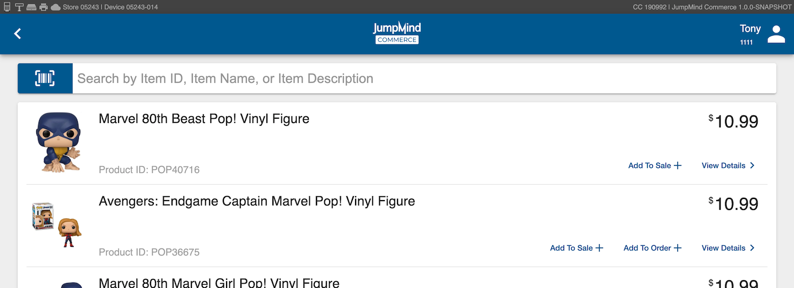
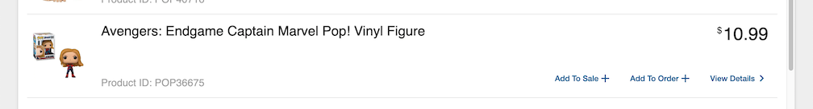
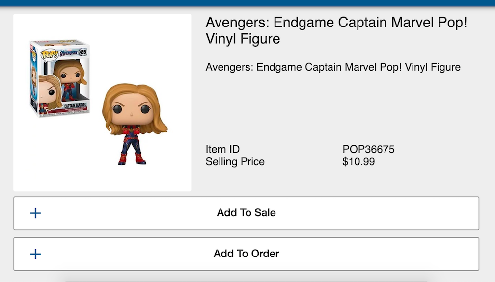

# Item Inquiry
Item inquiry is a sales functionality that allows the user to hand key search words to look for an item.

## Concepts 

## Terminology
|Term|Definition|
|---|-----|
|||
|||
|||
## Item Inquiry screen

 

The Item Inquiry screen allows the user to have quick access to ___

### Screen parts

#### Item groups 
 

Item groups allow for configured 'quick search' access to key groups for line items. 

#### search bar

The search bar allows the user to enter a key word or description or a item number, which then finds any cooresponding items.

#### Header 

The header in item inquiry gives access to user info(link to sales) and a back arrow which guides the user back to the transaction screen

### Inquiring an item

 INquiring an ite is the process of seaching for an item manually as opposed to scanning it.
#### Searching for an item 

|Functionality|Description|
|---|-----|
|Add to sale| Individual line items have an 'add to sale' functionality which, when selected, ads the item to the transaction|
|add to order|Add to order allows for an order to be placed within store, this allws for an out-of-stock item to stll be purchased|
|View details |View details opens a larger screen which gives essential inormation on the line item|

#### Add to sale
 Individual line items have an 'add to sale' functionality which, when selected, adds the line item to the transaction
 
#### View details 

 View details opens a larger screen which gives essential information on the line item. These detilad include the item ID, product name, seling price, while still having access to the 'add to sale' and 'add to order' functionalities
 
#### add to order 
Add to order allows for an order to be placed within store, this allows for an out-of-stock item to stll be purchased

