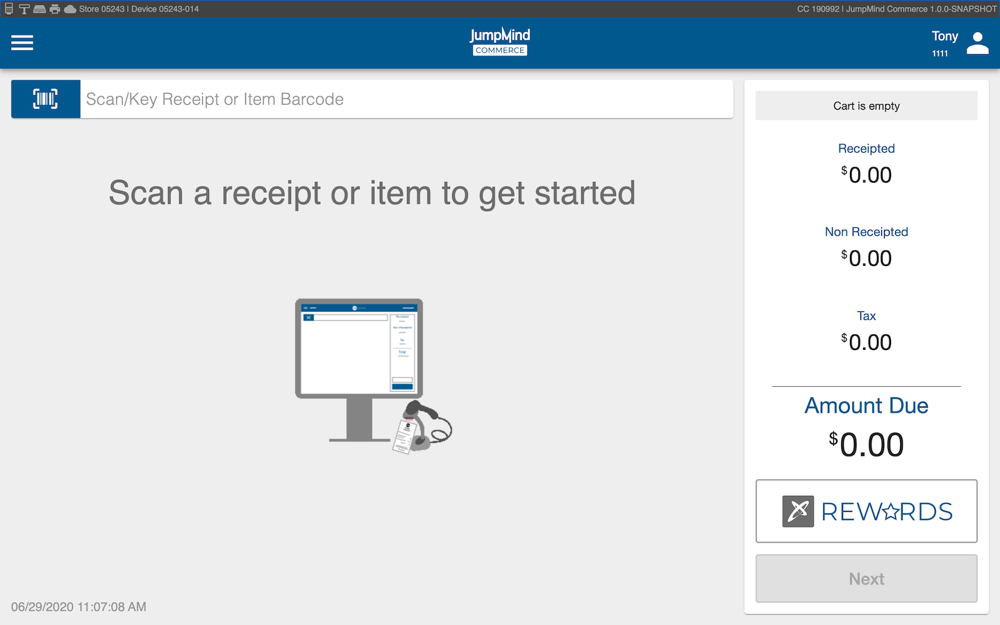
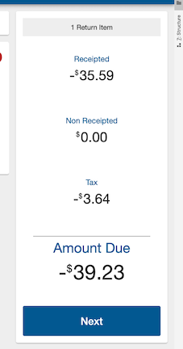
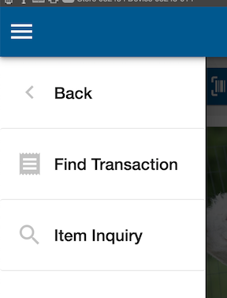
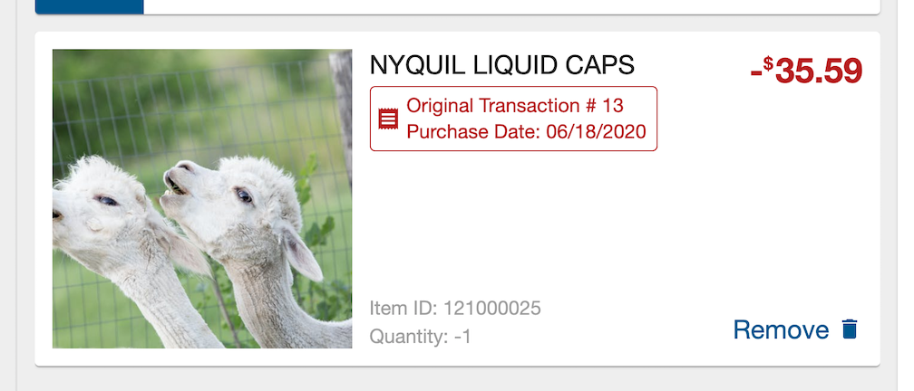
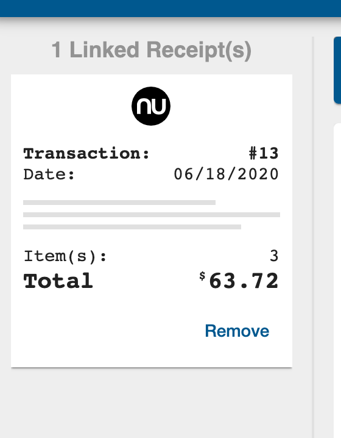

# Returns Management
Return management is the process in which a purchased item is returned to the seller in exchange for the initial investment.

## Concepts
Some of the key concepts that will be address in this section include:
- *Configurable return policy* - Return policy is a configurable setting that allows for the unique setting a store wants
 
## Terminology
| Term | Definition | 
|------|------------|
|Reason code|Reason codes allow for returns to be defined by the user|
| Disposition code| disposition codes define what happens to the item after the return. E.g. Restock, Non-Sellable,etc.|
|Blind return|A blind return is hard to explain briefly |

## Return screen 
The returns screen gives access to key functionalities to perform a return. 

The return screen looks as follows:

### Screen parts 

#### Status bar 
 link to sales
#### Return summary

 |Title|Functionality|
 |---|-----|
 |Quantity| The number of items being returned will be presented in the format '_ Return item(s)'|
 |Receipted|Under 'receipted' will be a negative value which equayed to the amount the business owes the consumer on a return that had a receipt|
 |non Receipted|Under 'Non Receipted' will be a negative value which equates to the amount the business owes the consumer on a return that did not have a receipt|
 |Tax|The retuned tax value will be presented in a negative number under 'tax'|
 |Amount due|The Amount Due is a total number that equals all returned tender|
 

#### Screen header
The Screen Header gives access to the Return Menu and the User Information 
 

|View |What it is|Description|
|---|----|-------|
|| Return menu|This menu allows you to access relevant and essential functionalities that for a return.|
| |User Information |Link to sales|

#### Item Search

Item search allows the user to search for an item that has a missing tag or can not be found otherwise .

#### Return item panel
The Return Item POnale has essential line item information that relates to a return

|section|purpose|
|---|-----|
|Item Image|Each item has a unique high resolution photo that matches the scanned item|
|Item Description|In bold lettering a description of each item in a Return.|
|Quantity|Quantity of the line item being returned|
|Price| In bold a negative number will reveal the amount that will be returned to the customer |
|Remove| Gives the user the ability to remove an item from a return|
|Original sale tag??(red box)|This ___ allows for the user to know original purchsase date and transaction numve, to help identity a purchase |

#### Linked receipts
linked receipts allows you to view all of the receipts that are linked to a loyalty customers account

#### Screen footer 
Reference sales?

### Returning an item 

#### Return policy
 Commerce supports a configured return policy, which allows for a unique return policy. ( dont love this wording)
E.G. store A requires a receipt and gives the consumer 30 days to return an item, but store B does not Require a receipt and offers 90 days for a return. 

#### Return type 
|Return type|Description|
|---|-----|
|Receipted Return |A receipted return is a return where the consumer has the initial receipt on a purchased item. |
|Non Receipted Return |A non-receipted return is a return where the consumer does not have the initial receipt on a purchased item.|
|Loyalty Return| A loyalty return is when a store allows for the consumer to return an item using their loyalty, which does not require a receipt|
|Blind Returns| Blind returns refer to the limited access a user has to the return information, preventing fraud and return manipulation|

#### Receipted return
A receipted return allows for the user to search for an item using the original receipt. Within this, the user can then scan the item, which will then allow for the return to be completed. 

#### Non receipted return
 A Non receipted return, or an unvalidated return, is a return that does not have a form of verification that the item was purchased or how it was purchased. These returns typcially result in a store credit refund as opposed to cash.

#### Reason Codes
 Reason codes allow a user to classify a return which will help dictate that products Disposition code
##### Disposition Codes
Disposition codes are what allows a store to know how to handle an item, after a return is complete.

