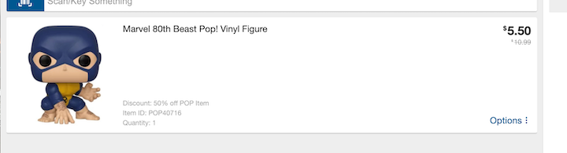
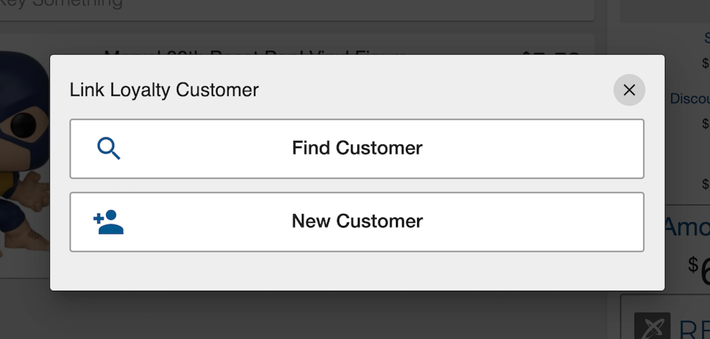
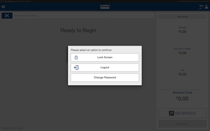

# Sales

A sale is the exchange of a commodity for money; the action of selling something.

This section of the documentation will address the features available 
to create a sale.  It will not include the checkout process which will
be discussed in another section.

## Concepts

Some of the key concepts that will be address in this section include:
- *Transactions* - A retail transaction is a stored representation of a sale.
- *Items* - Items are individual goods or services that are sold
- *Gift Cards* - Gift cards are electronic backed cards entitling the recipient to receive goods or services of a specified value from the issuer.
- *Configuration* - JumpMind Commerce supports a heavily configureable system that allows for adjustments to the preference of a business.

## Terminology

| Term | Definition | 
|------|------------|
|Retailer|The organization providing goods or services for sale|
|Customer|An individual that is purchasing goods or services |
|Promotion|An offer designed to publicize a product, typically in the fashion of a discount|
|Override| A manual change to a default setting. |
|Line item| A single scanned item in a transaction|
|configurable | Adjustable setting that allows for unique formatting |

## Sales Screen
The sales screens allow for transacting sales between a retailer and a customer.  The sales screen looks as follows:

### Screen Parts

#### Status Bar

|Symbol|What is represents|
|---|-----|
||Functional health of the Cash drawer|
||Functional health of the customer facing display|
||Functional health of the network |
||Functional health of the pinpad/payment device|
||Functional health of the printer|
||Store number|
||Which Device the transaction is being performed on|
||JumpMind Commerce software version number|

<How should I talk about yellow and red colors for icons>

#### Screen Header
The Screen Header gives access to Transaction Menu and the User Information 

|x|Y|z|
|---|----|-------|
||Application / transaction menu|This menu allows you to access relevant and essential functionalities that take affect on an entire transaction.|
|  |User Information |ifniejcemidjv|

#### Item key

Item keys allows the user to manually enter an item into a transaction.

- #### Item detail panel

The item detail panel provides essential information about a transaction. 

|section|purpose|
|---|-----|
|Item Image |Each item has a unique high resolution photo that matches the scanned item|
| Item Description|In bold lettering a description of each item in a given transaction can be read, and referenced.|
| Item Options  |Opening a line items options gives you the ability to access a configurable set of features that directly affect the line item.|
|Quantity|Quantity of the line item|
|Price| Bold numbers reveal fnal price per line item, while grey numbers are pre-discount.|
|Discount| I fa discount applies a discount description will be viewable|

#### Transaction Summary
   A summary of the current transaction that highlights essential transaction details.

 These details include:
 
 |Description|Functionality|
 |---|-----|
 |Item count|Total number of items in the cart|
 |Subtotal|The subtotal, or the pre-tax transaction cost, is viewable and automatically calculated for each item added. (promotions calculated for)|
 |Discounts / Credits|A running total of all promotions applied to a transaction can be viewed in the transaction summary viewing bar.|
 |Tax|The visible tax amount is the summation of the applied transaction tax, accounting for tax overrides and exemptions.|
 |Amount Due|The amount due is the all-inclusive cost that the customer owes for their transaction. This includes the subtotal and tax.|
 |Rewards|Loyalty information can be found HERE|
 
#### Screen Footer
The footer adds nonessential, yet helpful, information for the user of the system that ensures maximum productivity.

|Section|blah blah balh|
|---|-----|
|Date|Date that a transaction is taking place on|
|Time|The live time that a transaction is taking place on|
|Transaction number|The number transaction that has taken place on that day, in the specific store and on a specific till.|
|Timer|Running timer for each transaction that refreshes for each |

### Automated Loyalty Prompt  

The loyalty prompt allows you to associate a loyalty customer to a transaction.

|Prompt|Use|
|---|-----|
|| Customer search allows the user to find a loyalty customer using their provided customer information.|
| |Allows the addition of a new loyalty customer

### Item transaction options 
*The following are the transaction options:*
  
|Icon|Functionality|
|-----|--------|
||this is where the item inquiry tag info will go|
||return tag info ill go here|
||Words|
||this is where discount tag info will go|
||At any point during the sell process the user has the capability to suspend the transaction, for a configurable number of reasons.E.g. customer forgot an item. And this same transaction can be resumed from a new transaction options menu.|
||A previously suspended transaction can be resumed|
||The user also has the ability to cancel a transaction and it will be abandoned and marked as ORPHANED|
||Employee discounts are configurable to the protocol of a business |
||Tax exemption is permitted when a valid tax exemption code is applied to a transaction.|
|| WOrds|

### Line item options

   *The following actions can be taken on a line item.*

|Action|Description|
|-----|--------|
||Removing an item effectively takes the item and item cost out of the transaction, automatically affecting the amount due.|  
||Discounting a line item is a function that allows the user to manually insert a dollar value or percent that will be turned into a discount for the selected item. |
||The change quantity functionality allows for the user to duplicate an already scanned item, as opposed to scanning the same item several times.|
||A gift icon appears in the item detail panel for the customers who have requested a gift receipt.|
||Overriding a price on a line item gives the user the option to manually change the price of the item|
||XYXWDJO|
    

### User information options

*Within User Information you have access to the following functionalities*:

|X|Y|
|---|-----|
|Lock Screen |Commerce supports two lock screen functions. A manual lock and an automated, adjustable, time activated lock. Both of which require the user to re-enter their password to continue working.|
|Logout |Logout allows for the user to exit their account after a sale, which allows a new user to sign-in.|
|Change Password |Within the sale functionality a user can change their password|

 

  

### Selling an item

#### Scanning an item
  Scanning the items unique barcode allows for the cooresponding item to appear in the transaction, this applies to all scanned items.

#### Hand keying an item
Commerce offers the option the search for an item using a keyword or a product number. This allows for items with barcode errors to be added to a transaction with limited time waste.

- #### Sale Amount
    The sale amount on each item showcases the post promotion and pre-tax total of a line item.

- ####  Discounts / Promotions
    Current promotions and discount descriptions will be displayed in the item detail panel. 
Allowing the user to make sense of a discounted price

TODO: ignore below this for now

## Transactions
Talk about the different type of transactions:
  - Control - link to ops
  - Retail - The representation of a sale, return or exchange
  - Inquiry - Gift card balance inquiry outside of a retail transaction
  - Void - post void of an earlier transaction
  
### Unique Key

#### Transaction Number

#### Configurable Sequence Range

#### Device Id - Configurable format

#### Business Date yyyyMMdd

### Operations

#### Suspend / Resume

#### Cancel

#### Gift Receipt (QR Code)

#### Tax Exempt

#### Employee Discounts

## Items

### Entry

#### Scanning

#### Input Matcher

#### Item Preprocessor
- Auto padding to size

### Images

### Item Groups

#### Hierarchy

#### General Purpose

### Item Prompts

#### On Entry

#### At Checkout

### Selling Status Codes

#### Sale allowed

#### Return allowed

#### Return reason code id

### Custom Items

#### Prompt For

### Selling Rules

#### Weight Entry

#### Price Entry

#### Quantity Required

### Pricing Rules

#### Loyalty Pricing

### Operations

#### Quantity

#### Void

#### Price Override
After an item has been added to sale you can select options -> price override. Following this, manually insert the new value and select the reason of the override.

#### Manual Discounts

##### Single item discount
Manual single item discounts can be applied to a singular item by selecting options -> discounts -> percent discount or amount discount and inserting the corrrect discount for the specific item (with proper reasoning)

 

##### Transaction discount
Manual transaction disounts can be applied to the entire transaction by selecting hamburger menu -> discounts -> Percent discount or Amount discount and inserting the corrrect discount for the specific item (with proper reasoning)

#### Tax Override

## Gift Cards

### Activating

### Reloading

### Get Balance

### Cash Out

