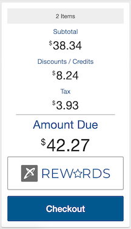
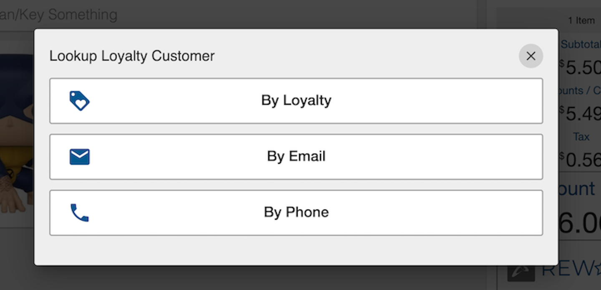
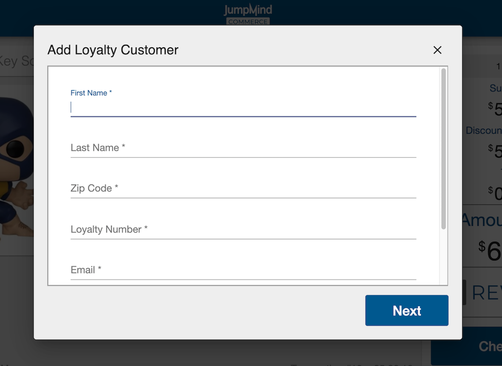
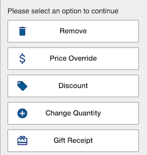

# Sales

A sale is the exchange of a commodity for money; the action of selling something.

This section of the documentation will address the features available 
to create a sale.  It will not include the checkout process which will
be discussed in another section.

## Concepts

Some of the key concepts that will be address in this section include:
- *Transactions* - A retail transaction is a stored representation of a sale.
- *Items* - Items are individual goods or services that are sold
- *Gift Cards* - Gift cards are electronic backed cards entitling the recipient to receive goods or services of a specified value from the issuer.
- *Configuration* - JumpMind Commerce supports a heavily configureable system that allows for adjustments to the preference of a business.

## Terminology

| Term | Definition | 
|------|------------|
|configurable | Adjustable setting that allows for unique formatting |
|Promotion|An offer designed to publicize a product, typically in the fashion of a discount|
|override| A manual change to a default setting. E.g. the default tax rate in ohio is 5.75%, but an override can manually change that value to 5% |
|Line item| A single item in a transaction|

## Sales Screen
The sales screen is a functional outlay of the sales process, which gives the user efficient access to all essential functionalities.

### Automated Loyalty Prompt  
The loyalty prompt allows you to associate a loyalty customer to a transaction.

### Screen Header
The Screen Header gives access to Transaction Menu and the User Information 

- #### Application / Transaction Menu 
 This menu allows you to access relevant and essential functionalities.
 E.g. Returns, Employee discount, tax exempt sale, etc.
 TODO SCREENSHOTS
- #### User Information   

    

*Within User Information you have access to the following functionalities*:

 -  ##### Lock Screen 
    Commerce supports two lock screen functions. A manual lock and an automated, adjustable, time activated lock. Both of which require the user to re-enter their password to continue working.

 
- ##### Logout 
  Logout allows for the user to exit their account after a sale, which allows a new user to sign-in. 

TODO SCREENSHOTS
 
- ##### Change Password  
    Within the sale functionality a user can their password, that matches the written criteria.

  

### Transaction Summary
   A summary of the current transaction that highlights essential transaction details.

>
 These details include:
- #### Subtotal
    The subtotal, or the pre-tax transaction cost, is viewable and automatically calculated for each item added. (promotions calculated for)
 
- #### Discounts / Credits
    A running total of all promotions applied to a transaction can be viewed in the transaction summary viewing bar.

- #### Tax
    The visible tax amount is the summation of the applied transaction tax, accounting for tax overrides and exemptions.

- #### Amount Due 
    The amount due is the all-inclusive cost that the customer owes for their transaction. This includes the subtotal and tax.

### Rewards
TODO 

- #### Find Customer
    Customer search allows the user to find a loyalty customer using their provided customer information.
    

 

- #### New Customer 
  Adding a loyalty customer is easily accesible and configurable to the wants of the business. Allowing the business to allocate which customer information is optional and which is deemed required.

### Screen Footer
The footer adds nonessential, yet helpful, information for the user of the system that ensures maximum productivity.

- #### Date and Time 
    The Date and Time are easily viewable in the footer a transaction screen.

- #### Transaction Information
    The transaction number __number per day?__ and a running timer for the given transaction are viewable in the sell screen

### Selling an item

#### Scanning an item
  Scanning the items unique barcode allows for the cooresponding item to appear in the transaction, this applies to all scanned items.

#### Hand keying an item
Commerce offers the option the search for an item using a keyword or a product number. This allows for items with barcode errors to be added to a transaction with limited time waste.

### Item detail panel

The item detail panel provides essential information about a transaction. 

- #### Item Image 
    Each item has a unique high resolution photo that matches the scanned item __what is the proper reasoning for this__ 

- #### Item Description
    In bold lettering a description of each item in a given transaction can be read, and referenced.

- #### Sale Amount
    The sale amount on each item showcases the post promotion and pre-tax total of a line item.

- ####  Discounts / Promotions
    Current promotions and discount descriptions will be displayed in the item detail panel. 
Allowing the user to make sense of a discounted price

### Item Options  
Opening a line items options gives you the ability to access a configurable set of features that directly affect the line item.
>

*The following actions can be taken on a line item.*

|Action|Description|
|-----|--------|
||Removing an item effectively takes the item and item cost out of the transaction, automatically affecting the amount due.|
||Discounting a line item is a function that allows the user to manually insert a dollar value or percent that will be turned into a discount for the selected item. |
||The change quantity functionality allows for the user to duplicate an already scanned item, as ooposed to scanning the same item several times.|
||A gift icon appears in the item detail panel for the customers who have requested a gift receipt.|
||Overriding a price on a line item gives the user the option to manually change the price of the item|
||XYXWDJO|
- #### Remove
    Removing an item effectively takes the item and item cost out of the transaction, automatically affecting the amount due.

- #### Price Override
    Overriding a price on a line item gives the user the option to manually change the price of the item for a reason selected from a pre-determined configurable list. 
E.g. An item was listed as 5$, but when scanned came up as 8$, the user now has the option to override the 8$ to 5$.

- #### Discount
    Discounting a line item is a function that allows the user to manually insert a dollar value or percent that will be turned into a discount for the selected item. 
Manual discount reasoning is configurable as well. 

-  #### Change Quantity
    The change quantity functionality allows for the user to duplicate an already scanned item, as ooposed to scanning the same item several times. 
I.e.This can be used when purchasing several of the same item.

-  #### Gift Receipt
    A gift receipt is accessible for a customer who is buying an item as a gift. A gift icon will appear in the item detail panel, which notes that a gift receipt has been requested for that item.
 
- #### Tax Override
    __not sure what to put here__
 
### Transaction Options 
Transaction options are a configurable set of options that allow the user to prompt an action that takes affect on the entire transaction.

|Icon|Definition|
|-----|--------|
||this is where the item inquiry tag info will go|
||return tag info ill go here|
|| WOrds|
||Words|
||this is where discount tag info will go|
||At any point during the sell process the user has the capability to suspend the transaction, for a configurable number of reasons.E.g. customer forgot an item. And this same transaction can be resumed from a new transaction options menu.|
||The user also has the ability to cancel a transaction and it will be abanded and marked as ORPHANED|
||Employee discounts are configurable to the protocol of a business |
||Tax exemption is permitted when a valid tax exemption code is applied to a transaction.|

- #### Suspend / Resume
    At any point during the sell process the user has the capability to suspend the transaction, for a configurable number of reasons.
 E.g. customer forgot an item. And this same transaction can be resumed from a new transaction options menu.

- #### Cancel
    The user also has the ability to cancel a transaction and it will be abanded and marked as ORPHANED 
__not sure if this is true, but it was the case for a locked screen in user management so i thought Id take a shot in the dark and add it__
 
- #### Tax Exempt
    Tax exemption is permitted when a valid tax exemption code is applied to a transaction. 

- #### Employee Discounts
    Employee discounts are configurable to the protocol of a business 
__what should be said aside from what was said in the verification section of user management__ 

TODO: ignore below this for now

## Transactions
Talk about the different type of transactions:
  - Control - link to ops
  - Retail - The representation of a sale, return or exchange
  - Inquiry - Gift card balance inquiry outside of a retail transaction
  - Void - post void of an earlier transaction
  
### Unique Key

#### Transaction Number

#### Configurable Sequence Range

#### Device Id - Configurable format

#### Business Date yyyyMMdd

### Operations

#### Suspend / Resume

#### Cancel

#### Gift Receipt (QR Code)

#### Tax Exempt

#### Employee Discounts

## Items

### Entry

#### Scanning

#### Input Matcher

#### Item Preprocessor
- Auto padding to size

### Images

### Item Groups

#### Hierarchy

#### General Purpose

### Item Prompts

#### On Entry

#### At Checkout

### Selling Status Codes

#### Sale allowed

#### Return allowed

#### Return reason code id

### Custom Items

#### Prompt For

### Selling Rules

#### Weight Entry

#### Price Entry

#### Quantity Required

### Pricing Rules

#### Loyalty Pricing

### Operations

#### Quantity

#### Void

#### Price Override
After an item has been added to sale you can select options -> price override. Following this, manually insert the new value and select the reason of the override.

#### Manual Discounts

##### Single item discount
Manual single item discounts can be applied to a singular item by selecting options -> discounts -> percent discount or amount discount and inserting the corrrect discount for the specific item (with proper reasoning)

 

##### Transaction discount
Manual transaction disounts can be applied to the entire transaction by selecting hamburger menu -> discounts -> Percent discount or Amount discount and inserting the corrrect discount for the specific item (with proper reasoning)

#### Tax Override

## Gift Cards

### Activating

### Reloading

### Get Balance

### Cash Out

