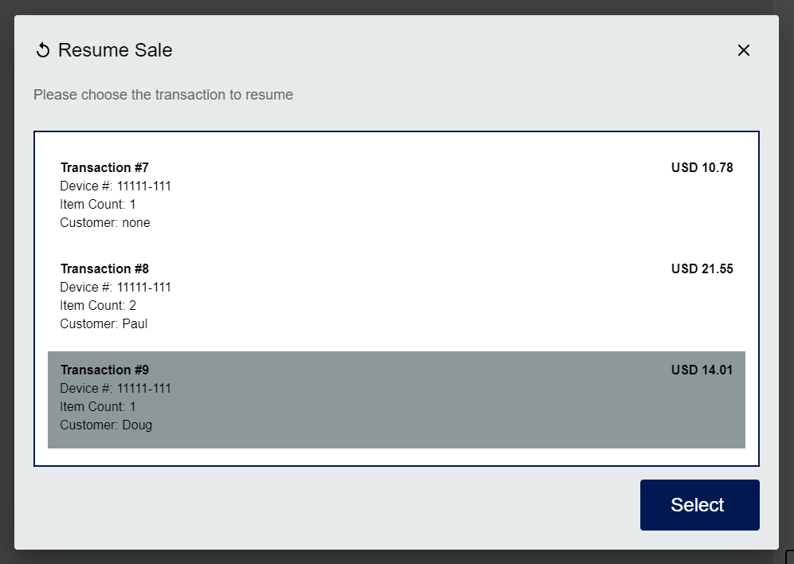
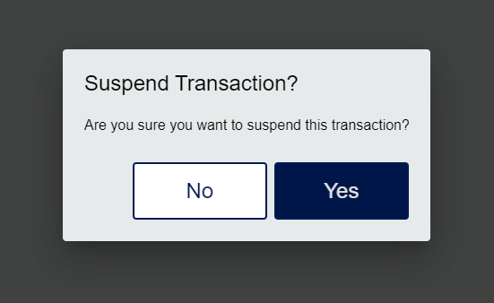
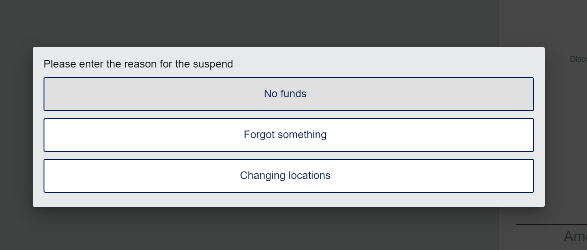

# Transaction Operations

## Suspend / Resume

At any point during the sell process the user has the capability to suspend the transaction, for example if a customer forgot an item. This same transaction can be resumed from the transaction menu on the sale screen.


Transactions can be suspended or resumed on any device within the store.  For example, if you suspend a transaction on a mobile device it can be resumed later on a fixed register.



Suspending a transaction prompts the user for a reason, which is then saved in the `SLS_RETAIL_TRANS.SUSPEND_REASON_CODE` field.




### Configuration

Suspend/Resume functionality can be configured with the following settings.

To add the Suspend/Resume button configuration to the sale screen transaction menu:

``` sql
insert into ctx_button (button_group_id, button_id, parent_button_id, display_order, button_name, button_type, button_value, enabled, icon_type, effective_start_time, effective_end_time, create_time, create_by, last_update_time, last_update_by)
  values ('sale.transaction.active','SuspendTransaction',null,46,'Suspend','action','SuspendTransaction',1,'SuspendAction',{ts '2018-12-27 13:43:09.000'},null,{ts '2018-12-27 13:43:09.000'},'test',{ts '2018-12-27 13:43:09.000'},'you');

insert into ctx_button (button_group_id, button_id, parent_button_id, display_order, button_name, button_type, button_value, enabled, icon_type, effective_start_time, effective_end_time, create_time, create_by, last_update_time, last_update_by) 
  values ('sale.transaction.inactive','Resume',null,30,'Resume','action','Resume',1,'RetrieveAction',{ts '2019-01-18 10:23:09.000'},null,{ts '2019-01-18 10:23:09.000'},'test',{ts '2019-01-18 10:23:09.000'},'you');
```

To configure suspend reason codes:

``` sql
insert into ctx_reason_code (reason_code_group_id, reason_code_id, display_value, display_order, display_default, create_time, create_by, last_update_time, last_update_by)
  values ('SuspendTransaction', '10', 'No funds', 1, 0, {ts '2019-01-15 13:57:09.000'}, 'test',{ts '2019-01-15 13:57:09.000'}, 'you'),
  ('SuspendTransaction', '20', 'Forgot something', 2, 0,{ts '2019-01-15 13:57:09.000'},'test',{ts '2019-01-15 13:57:09.000'}, 'you'),
  ('SuspendTransaction', '30', 'Changing locations', 3, 0,{ts '2019-01-15 13:57:09.000'},'test',{ts '2019-01-15 13:57:09.000'}, 'you');
```

To enable/disable the Suspend/Resume via application.yml:

``` yml
openpos:
  sell:
    sellItemActionHandlers:
      transSuspend:
        isVisible: true
```

## Cancel

Cancel the current transaction and void all authorizations associated with the transaction. Also referred to as mid-void.

## Gift Receipt

Print a gift receipt for the current transaction after tendering.

## Tax Exempt

Mark the current transaction as tax exempt.

## Employee Discounts

Search for employee discounts to apply to the current transaction

## Item Inquiry

Search for a specific item using keywords or item identifiers.

## Gift Cards

Perform actions related to gift cards, such as issuing a new gift card or doing a balance inquiry on an existing card.
