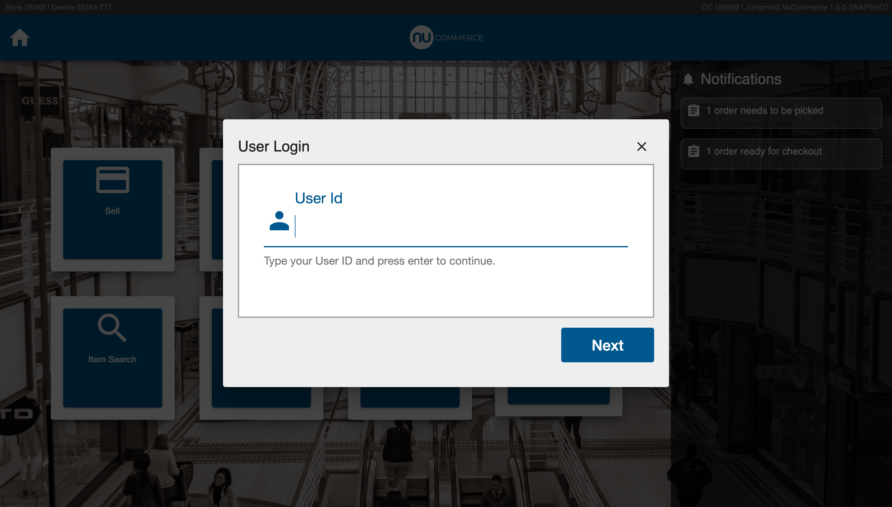
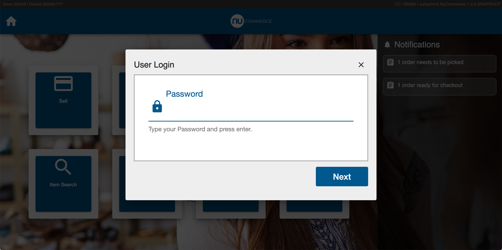
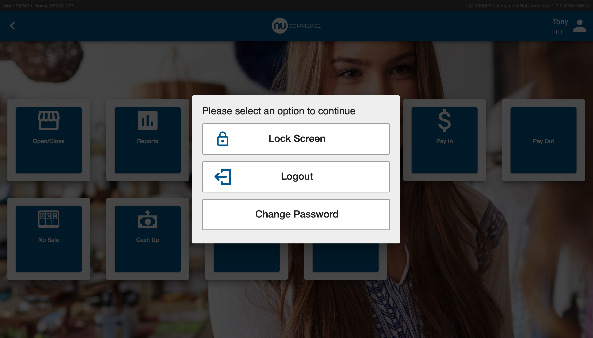
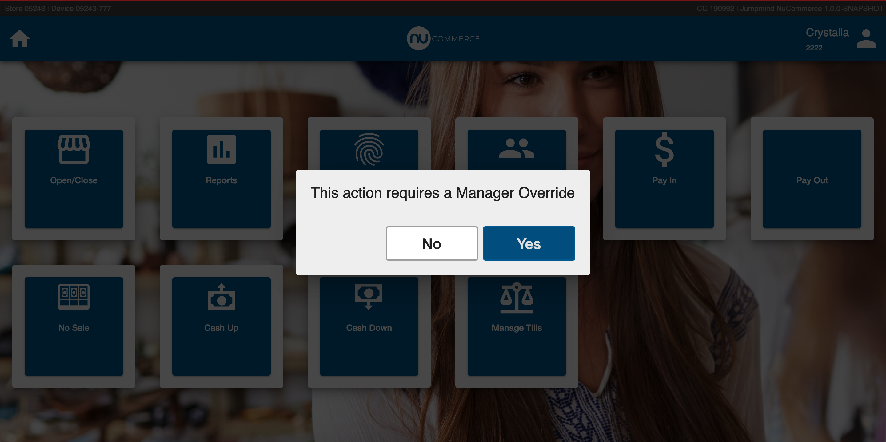
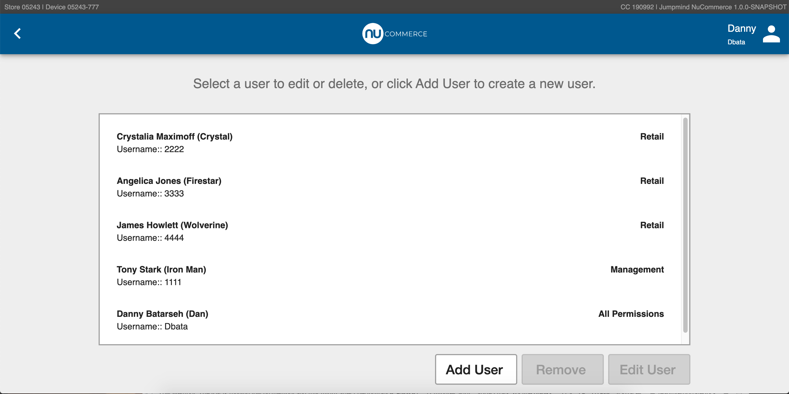
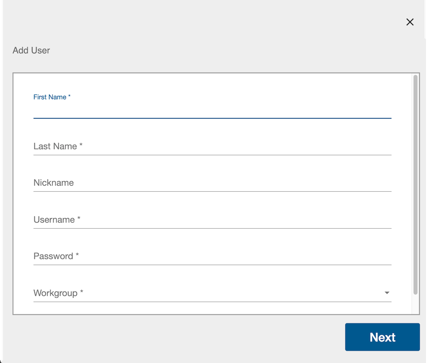
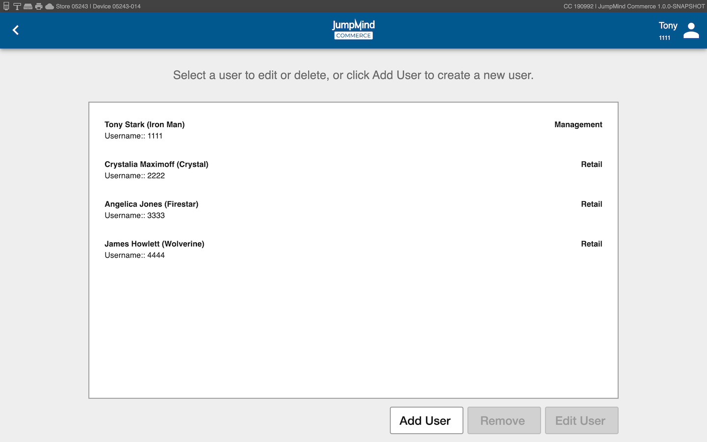
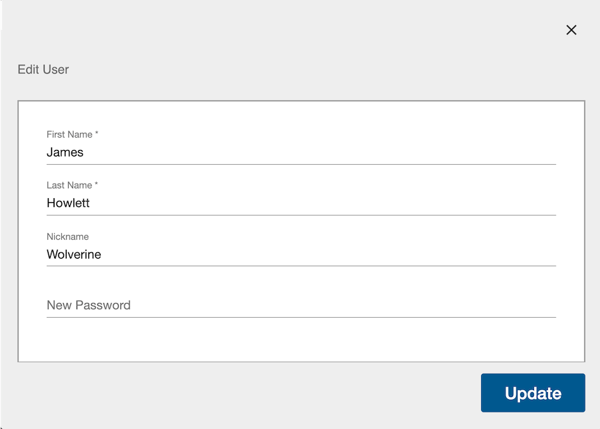
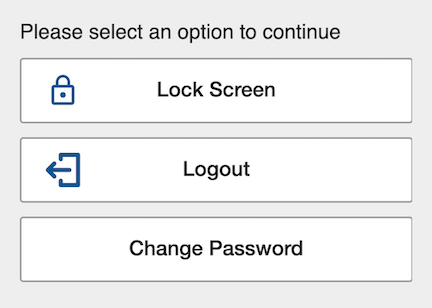

# User Management
The User Management module is responsible for providing authentication and authorization to the 
commerce applications as well as verification that individuals belong to the organization. Through User
Management, a set of user workgroups can be created and maintained that control permissions
for a set of users in a common bussiness role (i.e. cashier, store manager, etc.)  

In addition to internal, commerce managed users and user workgroups, out of the box integrations
can be used to validate users and roles from third party systems such as Single Sign On and other
Lighteweight Directory Access Protocol (LDAP) based systems.

## Concepts
User management provides capabilities for four major concepts:

- *Authentication* is the process of verifying who a user is. This is usually accomplished by 
providing a username and a password, but can be accomplished in other ways including biometrics, tokens
 (key fob or software token), etc. or can be used in combination to provide two factor authentication.

- *Authorization* is the process of verifying what a user has access to within an application. 
Permissions are assigned to workgroups and users are added to their job specific workgroup resulting
in different functional access to the appliation by user and user workgroup.

- *Verification* is used by commerce application to validate that an individual is active and belongs to the organization.
An example of verification is the employee discount functionality.

- *Administration* is the act of adding and managing users and user workgroups.  Most enterprise implementations
have this feature disabled because users are sourced from other systems.

## Terminology

| Term | Definition |
|------|---------------|
| User | An individual with his/her own username and password that can log into commerce. | 
| User Workgroup | A grouping of users with the same access. ie. Management, Retail. Each individual User is assigned to one User Workgroup. |
| Permission | Permissions define functionality in the point of sale that determine if a user can access a said function. Permissions are assigned to user workgroups and if the user is part of a workgroup with that permission, then the user has access. |
| Authentication | The process of confirming that the user is who the user says they are. |
| Authorization | The permission given to a specific user wokrgroup. |
| SSO | SSO, or single-sign-on, is an authentication strategy that allows for the use of a single username and password for authentication. |
| LDAP | LDAP (Lightweight Directory Access Protocol) is an open and cross platform protocol used for directory services authentication. LDAP provides the communication language that applications use to communicate with other directory services servers. |
| Manager override | The manager has the ability to permit an action that another user does not have the permission id for. |

## Authentication
Authentication is the confirmation that the user is who the user says they are. There are several ways to achieve this. 

### Types of Authentication
The commerce solution provides authentication through internal security measures or through integration
to third party systems.  For internal security, the commerce application can provide authentication through: 
 - Password
 - Biometric (fingerprint)
 
 For security through integration to a third party system, the commerce application has out of the box
 integration for:
 - LDAP
 
 Other custom integration for authentication can also be easily completed for various single sign on (SSO) 
 systems.
 
### The Authentication Process 

  - When attempting to use the system, a user is prompted to login  
  

### The Logout Process
The logout process allows for a signed in user to exit the commerce system.

    
  
### The Lock Screen
When a user has been logged into the system for a configurable time period without activity, 
the screen is locked, and that same user must re-login to continue work. 

If the system is locked by a user who is no longer available, another user may "break"
the lock if that user has appropriate permissions to do so.  If a user lock is broken, and the previous
user was in the middle of ringing a transaction, the existing transaction is abandoned
 and marked as ORPHANED. 

## Authorization

Each user is associated with one or more user workgroups (i.e. "Cashier" and "Management" are two logical 
workgroups that can be created to differentiate a sales associate's access versus a manager's access.

### Permissions
 Each workgroup is assigned permissions which determine the access that the users in that workgroup have 
 to different functionalities in Commerce. The list of possible permissions are found under 
 [Permissions](users.md#permissions).

### Manager Override
  When a user is already logged into the system and they attempt access to a functional subsystem that requires a specific authorization
    that the logged in user does not already have they are prompted for a manager override if the function is overrideable.
   
 

## Verification 
Identifying a user can be useful in other scenarios in the commerce engine other than authentication.  
Users can be verified for things such as providing employee discounts, etc.  When an employee discount
is provided the requested user can verified against the user store.

## Administration

### Managing Users
Commerce users with manager access have the ability to mange users in their database.
 TODO SCREENSHOTS

*The functions involved in managing users are:*

-  ##### Add User 
Create new JumpMind Commerce user accounts to assign a new user to a workgroup. TODO SCREENSHOTS
 
 *After a User has been added, this user can be subject to the following functionalities.*
  
-  ##### Search for User / List Users
A list of all pre-existing users, along with their respective workgroups gives accces, allowing for account removal or for the user information to be disaplyed and edited.
 TODO SCREENSHOTS
 
-  ##### Display / Edit User Information_
Once the user has been selected their information can be viewed and edited
 TODO SCREENSHOTS
 
- ##### Reset User Password
User passwords can be reset 
 TODO SCREENSHOTS
 
- ##### Lock / Disable User Account
JumpMind Commerce user accounts can be revoked access through locking a user account.
 TODO SCREENSHOTS
 
- ##### Unlock User Account
Locked/Disabled user accounts can be unlocked which re-grants the user their respective workgroup permission id's. 
 TODO SCREENSHOTS
 
!! different variation !!
### Managing Users
Commerce users with manager access have the ability to manage users in their database.

The highlighted functions involved in managing users are:

-  Add User

- Display / Edit User Information

- Search for User / List Users

- Remove user 

- Reset User Password

- Lock / Disable User Account

- Unlock User Account

 ##### Add User 
Create new JumpMind Commerce user accounts to assign a new user to a workgroup. 

 
 *After a User has been added, this user can be subject to the following functionalities.*
  
 ##### Search for User / List Users
A list of all pre-existing users, along with their respective workgroups gives access, allowing for account removal or for the user information to be disaplyed and edited.
 
 ##### Display / Edit User Information_
Once the user has been selected their information can be viewed and edited. specifically, name, username, and password.
  
 
 * The following functionalities can be accesed within the user menu*
 
 
 
 ##### Reset User Password
User passwords can be changed 

##### Lock / Disable User Account
JumpMind Commerce user accounts can be revoked access through locking a user account.
 
##### Unlock User Account
Locked/Disabled user accounts can be unlocked which re-grants the user their respective workgroup permission id's. 
