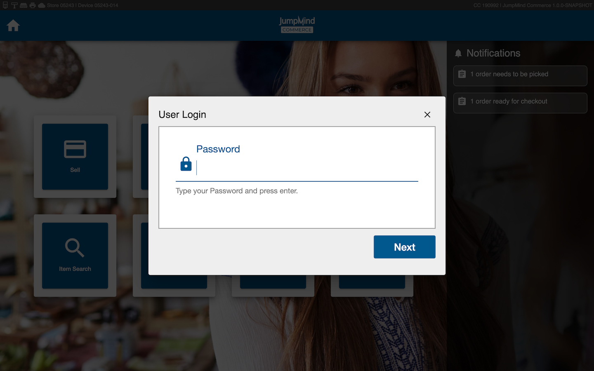

# User Management
User management is what allows the user to use the application. pretty much a who can do what
concept vs. functional 
functiona is how the conept is used
## In Store Management
The ability to manage user accounts in store.
- add acounts 
- edit accounts
- erase accounts 
## Authentication Types
Authentication is the confirmation that the user is who the user says they are. There are several ways to achieve this. 
Nucommerce supports two secure ways. 
1. Password-  passowrd is a criteria based password, ensuring uniqueness.
2. Fingerprint Biometrics (MORE DETAIL ON FINGERPRINT)  

Internal vs. External verification 
1. The internal verification is when the password or fingeprint biometrics is approved locally within Nucommerce
2. The external verification is when the access is granted through a third party after a seperate verifcation process, meaning it is not done through Nu commerce.

### Strategies
- Authentication
- Authorizaion

#### Lookup

#### Authorization
[not sure this belongs here] Authorization is the extent to which the user is able to use the software. differnt wokrgroups have differnt accces and differnt users sre assigned to different wokrgroups. for example, you can have a cahiser, amnager, assitant manger and each of these roles have differnt persmision. 

### Local

#### Terminology
  * *User* - An individual with his/her own username and password that can log into Nu Commerce. 
  * *User Workgroup* - A grouping of users with the same access.
  ie. Management, Retail. Each individual User is assigned to one User Workgroup.
  * *Permission* -  Permissions define functionality in the point of sale that determine if 
  a user can access said function. Permissions are assigned to user workgroups and if the
  user is part of a workgroup with that permission, then the user has access.
  * *Authentication* - The process of confirming that the user is who the user says they are.
  * *Authorization* - The permission given to a specific user wokrgroup
#### Functional
ow all of the above metoed concepts rok
##### Managing Users
Nu Commerce users can be managed through the Manage Users screen. Users can get
to this screen by selecting the 'Manage' button from the Home screen followed by
the 'Users' button (Home -> Manage -> Users). Only users in a workgroup who have the 
permission of *'manage.menu'* are able to enter into the Manage screen and make changes to users:

###### Add User
Users can be added by selecting the 'Add User' button under the Manage Users screen and filling out the
required User information.

###### Set Security Questions User

###### Search for User / List Users
The list of all users is found on the Manage Users screen.

###### Display / Edit User Information
To make changes to a user's information, select the user in the Manage Users screen and then click 'Edit User'.

###### Reset User Password
A user's password can be reset by selecting the user on the manage users screen and clicking 'Edit User'.

###### Lock / Disable User Account

###### Unlock User Account

###### Security - How to log in  / What do I Have Access To?

###### Signing into the POS
To Sign into Nu Commerce, the user will be prompted to enter their username and password. The password that is entered
is hashed and authenticated to check that the password is correct and not expired. If the
password is incorrect, it will block the user from signing in and prompt for login again. If the password
entered is correct but the current password expired, then it will prompt the user to enter and save a new password. Finally,
if the password is correct and not expired, it will allow the user to sign in successfully.

###### What do I have Access To?
Each user is assigned to a specific user workgroup which are defined under the usr_workgroup table.
For example, "Management" and "Retail" are two logical workgroups that can be used to differentiate managers
from sale associates. Each workgroup is then assigned permissions in the usr_workgroup_permission table which
determine the access that the users in that workgroup have to different functionality in Nu Commerce.
The list of possible permissions are found below under [Permissions](users.md#permissions).
  

### SSO

### LDAP

#### Mixed mode

### Biometrics (OOB U are U 4500)

## Password Criteria
Pasword criteria is the mandatory criteria needed to permit a password as acceptable. This criteria is -

The password should be at least 4 characters long, and must contain at least one lowercase, one uppercase, one number, and a special character such as "! @ # $ % ^ & ~".

## Permissions

## Manager Overrides

## Login / Logout

### Login
To log into a user account on Nu commerce, select any function on the main menu and follow the prompted screens to enter a valid user id and password. 
(Select any function -> enter valid user id -> next -> enter valid passowrd -> next)

### Logout
To logout of a Nu commerce account, select the icon in the upper right hand corner of the screen, and select 'logout'. 

