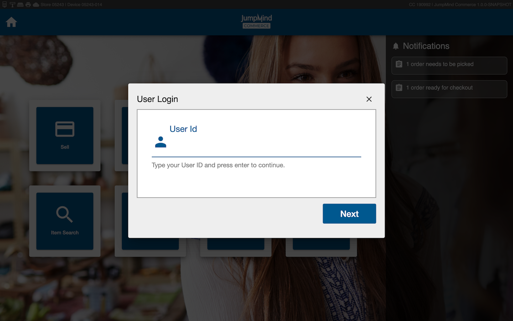

# User Management
User management is the functional module that is responsible for providing 
authentication and authorization to commerce applications as well as verification 
that individuals belong to the organization.   

## Concepts
User management consists of three major concepts.

- *Authentication* is the validation that the user has access to the system.  This is usually accomplished by 
providing a username and a password, but can be accomplished in other ways.
- *Authorization* is the concept of providing access to different functionality in a commerce application. 
Permission are assigned to workgroups and users are added to their job specific workgroup, giving them certain permissions.
- *Verification* is used by commerce application to validate that an individual is active and belongs to the organization.
An example of verification is the employee discount functionality.
- *Administration* is the act of adding and managing users.  Most enterprise implementations
have this feature disabled because users are sourced from other systems.

## Terminology

Maybe this should be a table?

- *User* - An individual with his/her own username and password that can log into Nu Commerce. 
- *User Workgroup* - A grouping of users with the same access. ie. Management, Retail. Each individual User is assigned to one User Workgroup.
- *Permission* -  Permissions define functionality in the point of sale that determine if 
  a user can access a said function. Permissions are assigned to user workgroups and if the
  user is part of a workgroup with that permission, then the user has access.
- *Authentication* - The process of confirming that the user is who the user says they are.
- *Authorization* - The permission given to a specific user wokrgroup
- *SSO*
- *LDAP*

## Authentication
### Types of Authentication
Authentication is the confirmation that the user is who the user says they are. There are several ways to achieve this. 
The commerce solution supports two secure ways. 
 - Password
 - Biometrics
 - Single Sign On
#### Password Type
 password is a criteria based password, ensuring uniqueness.  
 
 There are two implementations of password types: Local and LDAP.  Each of these can be used independently or in conjunction via a strategy.
 
 Local is ...
 
 LDAP, or Lightweight Directory Access Protocol, is another way to store usernames and password. (more detail)

##### Password Type Strategies
- User Strategy
  - Local
  - LDAP
- Password Strategy
  - Local
  - LDAP
  - Mixed
 
#### Fingerprint Biometrics Type (MORE DETAIL ON FINGERPRINT)  
- OOB, or out-of-band, authentication uses a second, and seperate communication channel to make authentication more secure.
- [U.are.U 4500](https://www.neurotechnology.com/fingerprint-scanner-digitalpersona-u-are-u-4500.html) is the model of biometric scanner.

#### SSO Type
SSO, or single-sign-on, is an authentication strategy that allows for the use of a single username and password for authentication.
Is this external or internal

### Login
  - When a functional subsystem requires a specific authorization the user of the system is prompted to login (link to different section)  
  - The login process uses the commerce systems configured Authentication mechanism (link to different section)
  - When a user has been login in for a configurable time period without activity, the screen is locked
  
To log into a user account on Nu commerce, select any function on the main menu and follow the prompted screens to enter a valid user id and password. 
(Select any function -> enter valid user id -> next -> enter valid passowrd -> next)

### Logout
To logout of a Nu commerce account, select the icon in the upper right hand corner of the screen, and select 'logout'. 

    
  
### Lock Screen
  - Same user must log back in to continue their work
  - If a manager break the lock, existing transactions are marked as ORPHANED

## Authorization

Each user is assigned to a specific user workgroup which are defined under the usr_workgroup table.
For example, "Management" and "Retail" are two logical workgroups that can be used to differentiate managers
from sale associates. Each workgroup is then assigned permissions in the usr_workgroup_permission table which
determine the access that the users in that workgroup have to different functionality in Nu Commerce.
The list of possible permissions are found below under [Permissions](users.md#permissions).

### Permissions
More details about permissions?

### Manager Override
  - When a user is already logged into the system and they attempt to access a functional subsystem that requires a specific authorization
    that the logged in user does not already have they are prompted for a manager override
  - Is this always true or does manager override need to be enabled?

TODO screen shots  

## Verification
- Commerce apps can lookup users for use in other parts of the system.
- Employee Discounts

## Administration

### Managing Users
Commerce users can be managed through the Manage Users screen. Users can get
to this screen by selecting the 'Manage' button from the Home screen followed by
the 'Users' button (Home -> Manage -> Users). Only users in a workgroup who have the 
permission of *'manage.menu'* are able to enter into the Manage screen and make changes to users:

###### Add User
Users can be added by selecting the 'Add User' button under the Manage Users screen and filling out the
required User information.

###### Search for User / List Users
The list of all users is found on the Manage Users screen.

###### Display / Edit User Information
To make changes to a user's information, select the user in the Manage Users screen and then click 'Edit User'.

###### Reset User Password
A user's password can be reset by selecting the user on the manage users screen and then clicking 'Edit User'.

###### Lock / Disable User Account
Concept- ability to stop a user from being able to access the system

###### Unlock User Account
Concept- ability to give access back to a user to use the  system

